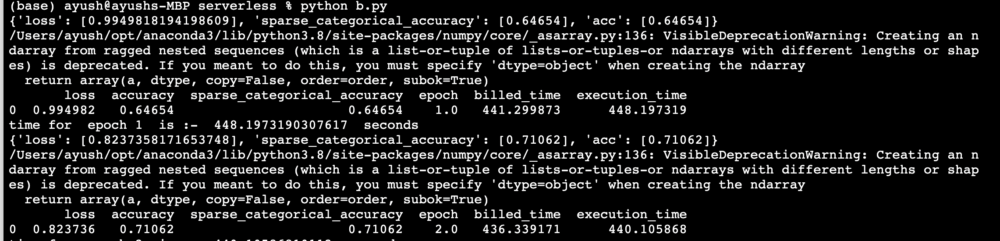

# ServerlessDistributedTraining
A distributed training model to train a model on CIFAR10 dataset on AWS lambda

it trains cifar 10 dataset on a CNN model with around 190k parameters

Installation Steps :-


1) create AWS account.
2) create a IAM user with programatic access :- https://docs.aws.amazon.com/IAM/latest/UserGuide/id_users_create.html
3) create a pyhton lambda function named project.override the content of the lambda by using upload from and option and using the zip file given in the project.
4) Attach the following layer to it :- arn:aws:lambda:us-east-1:347034527139:layer:tf_1_11_keras:3
5) test the function with following input 
```
{
  "start": 0,
  "end": 50,
  "weights": "0"
}
```
6) open main.py and set the required params , access key ,aws hosted zone 
7) Run the file from a jupyter notebook terminal.(the code takes this as assumption, on other it is not tested)

Sample logs:- 
<p align="center">
  
</p>
